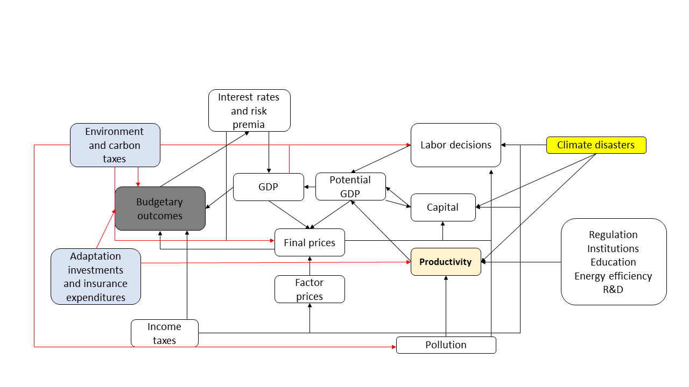

A short post about some of the design issues regarding the macroeconomics of climate change. There is a growing literature on this topic. This post summarizes my personal views on the matter.

# Background material

For a decent reference source see this [appication](https://openknowledge.worldbank.org/handle/10986/36307) to Pakistan. We discuss the types of macroeconomic models, but try to make things practical. The paper goes into a fair bit of detail on how to model carbon policy (inclusive of formal-informal labor markets) and the modeling of climate damages and potential for adaptation.

# Frameworks

The diagram below represents a simplistic overview of how climate change and climate policy can interact with macroeconomics. 

The blue frames represent climate policies, which can be summarized as:

1. Policies related to the environment and carbon management: Good examples include the Euro's emissions trading system (ETS), others include South Africa's carbon tax. The idea of managing carbon is to reduce emissions. Why do we want to reduce emissions? Because it changes the earth's climate (e.g., temperatures, rainfall wind etc.). Changes in the earth's climate may have potentially devastating consequences for all of us. Which brings us to the second climate policy.
2. Policies related to adaptation. Adaptation takes climate change as a given and tries to find ways to live with it. As an example, it may make sense to purchase insurance against catastrophic climate events (e.g., to protect your homes against storms). In other cases, it may make sense for the government to retrofit buildings in an effort to reduce the potential damages from natural disasters.

The justification for carbon taxes, as an example, is to reduce externalities. I.e., the tax corrects for a market distortion (think social benefit and social cost curves vs. private benefit and private cost curves). Typical externalities include pollution from carbon (e.g., in the form of particulate matter), or the net present value damages due to a change in climate. By increasing the price of fossil fuels via a tax, the government collects revenues. The government (i.e., people who elected the government) can choose to save the revenues to reduce debt service payments, they can employ a revenue-neutral strategy by transferring funds to households, or they may reduce other distortionary taxes (e.g., personal income or corporate taxes). The carbon price makes fossil fuels relatively more expensive relative to other forms of energy. Then, depending on price elasticities of demand and supply, there may be a substitution away from fossil fuels to renewables. Note that this economic model needs to account for the inflationary implications of the policy.

The yellow frame represents climate damages. Natural disasters affect our assets (public roads, investment portfolios, residential areas to name a few). If it affects a factor of production (e.g., capital or labor) then damages will also have implications for potential GDP and the demand for production factors. There are several simultaneous effects at play that need to be accounted for. 

## Modeling of carbon pricing

To model the impacts of carbon pricing requires the modeling of the energy sector. We think of the energy sector producing energy $(Y^{ENE})$. Energy demand $(C^{ENE})$ (i.e., energy that is being consumed) is equal to that which is produced domestically, or that which is imported $(M^{ENE})$.

A big part of the energy sector is the power sector $(Y^{POW})$. Electricity is generated either from fossil fuels, such as oil, gas or coal, or it is generated using renewables, such as hydro, solar and wind.

Note that we tend to attach an emissions factor to each ton of oil equivalent burnt from fossil fuels. Hence, emissions are directly related to how much fossil fuels we burn $(EM = C^{OIL}\alpha_{OIL}+C^{GAS}\alpha_{GAS}+C^{COAL}\alpha_{COAL})$ 

In this system, the consumption of energy cannot exceed the supply $(C^{POW} \leq Y^{POW}+M^{POW})$. 

The power producer produces electricity using fossil fuels or renewables. If a government imposes a carbon tax then that cost can be passed onto the consumer (assuming that her demand for electricity is inelastic price changes). However, with a regulated price, the producer bears the burden of the tax. The producer's revenues (and hence profits) decline with a carbon tax, unless they substitute fossil fuels for renewables. There are several ways to model this substitution - a typical (not necessarily correct) way of approaching the modeling is via a [CES aggregator](https://en.wikipedia.org/wiki/Constant_elasticity_of_substitution). If fossil fuels and renewables are substitutes in the production of energy (they tend to be) then increasing the price of fossil fuels makes renewables relatively cheaper.

The diagram below illustrates an approach to modeling the energy sector. Consumption is bundled via a CES aggregator and the choice of energy also. 

**Note that there are several complexities when modeling energy:**

- The implicit cost of energy needs to take into account distribution losses, costs associated with maintanence and resource depletion.
- At what price does it make sense to strand existing assets? If the carbon tax is very high, then it might not make economic sense to run a power station generated by fossil fuels - revenues fall way below costs.
- At what rate can new power be built from renewables? This requires a detailed modeling of the costs in producing renewable power and the time it takes to build that new capacity (in some countries it may take many years).
- Historical estimates on the elasticity of substitution requires a lot of thought. In the diagram below we illustrate a simple model response to three elasticities of substitution. The top row illustrates aggregate consumption response to an increase in the price of good 1, while the bottom row represents the share of good 1 in the consumption basket. The left panel is a low elasticity of substitution. When prices rise for consumption good 1, the aggregate impact is large, while the share hardly changes. The right panel shows that a high elasticity of substitution cushions the impact on consumption, while the share of consumption good 1 falls materially. **In all cases, a carbon price will reduce emissions, but in the case when the elasticity of substitution is small, it will do so by decreasing aggregate demand as a whole, instead of reducing fossil fuels in the consumption or production basket.**

To overcome some of these complexities, it makes sense to connect macroeconomic models to energy planning systems such as [IIASA's MESSAGE](https://iiasa.ac.at/web/home/research/researchPrograms/Energy/MESSAGE.en.html) or [World Bank EPM](https://www.researchgate.net/publication/325534590_World_Bank_Electricity_Planning_Model_EPM_Mathematical_Formulation_World_Bank_Electricity_Planning_Model).

## Modeling of damages

Modeling damages are tricky! Natural disasters are unknown events. The **frequency** and **intensity** of damages can best be described as probability distributions. This makes planning for them really complicated. Natural disasters have different economic channels. The figure below describes a mechanism:

 

 We think of changes in temperature and rainfall to be driven by human activities and natural forces. This then changes weather patterns, with result being changes in the frequency and intensity of natural disasters. Natural disasters affect agricultural crops, it destroys capital, heat affects labor productivity etc.

 One can model natural disasters in a macro model either by specifying a damage function [see Auffhammer for a nice description](https://pubs.aeaweb.org/doi/pdfplus/10.1257/jep.32.4.33) and [Weitzman](https://www.jstor.org/stable/climchanecon.1.1.57) or  taking the damages as probability distributions directly as a model input variable. The latter can be presented as a 1 in 10-year event, or a 1 in 100-year event. This gives you a full range of estimates.

 There are several complexities in modeling damages:

 - They are uncertain. A policy approach would be to plan for expected damages, roughly equal to the annual average losses associated with the natural disaster. This can be approximated by taking the weight (e.g., the probability of an event) multiplied by the loss given the occurrence of that event.
 - Damages often neglect tipping points [see this illustration as an example](https://www.carbonbrief.org/explainer-nine-tipping-points-that-could-be-triggered-by-climate-change). Local damages may be much larger when tipping points occur.

 
## Conclusion

  Modeling damages should be central in highlighting the macroeconomic consequences of climate. By no means are the impacts small. Given the uncertain nature, and the potential for absolute devastation, it makes sense to reduce the changes of such catastrophic events materializing. In this case, carbon policy to limit emissions, is an important policy. The costs of carbon policy need not be negative once we consider the benefits when reducing externalities, or the appropriate management of revenues.

